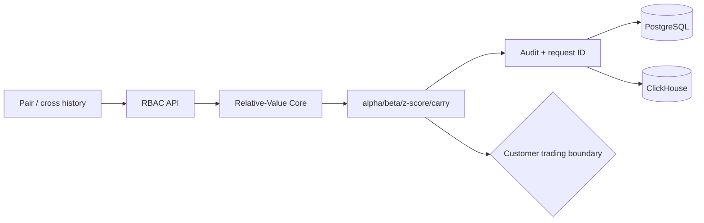

# Architecture — SYNERGY Relative Value

```mermaid
flowchart LR
A[Pair / cross history]-->B[RBAC API]
B-->C[Relative-Value Core]
C-->D[alpha/beta/z-score/carry]
D-->E[Audit + request ID]
E-->F[(PostgreSQL)]
E-->G[(ClickHouse)]
D-->H{Customer trading boundary}
```

Primary endpoint: `/enterprise/v1/relative-value/analyze`. Research discovery is deliberately separated from live execution.